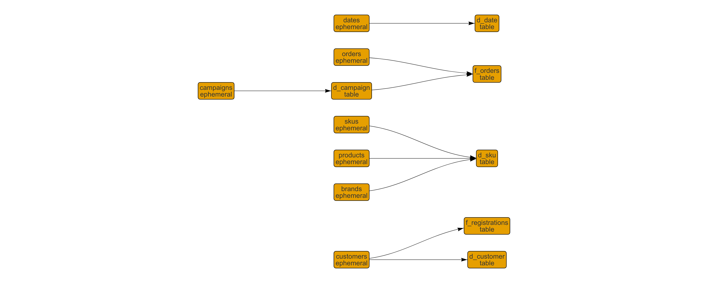

# Example Data Warehouse Project

This is an example [__dbt__](https://www.getdbt.com/) project for data warehouse projects.

FYI: The code in this project won't actually compile when run via `dbt run` or `dbt compile` since *dbt* won't be able to validate table relationships and the connection until you've modified `profiles.yml` and `dbt_project.yml` to point to a valid database.

This project currently only supports **Snowflake**, but can probably be made to work with Redshift with minor changes.

## Quickstart

1. Install [dbt](https://docs.getdbt.com/docs/installation)
2. Clone repo
3. Create a profile file with connections to your Snowflake or Redshift instance in `~/.dbt/profiles.yml`. Make sure to create both production `prod` and development `dev` sections for your database (Redshift, Snowflake or BigQuery) and set the default target to `dev`, following these [instructions](https://docs.getdbt.com/docs/configure-your-profile).

For example:
```
my-profile:
    outputs:
        prod:
            type: snowflake
            threads: 8
            account: myaccount
            user: dbt_user
            password: mypassword
            role: dbt_role
            database: dw
            warehouse: dbt
            schema: dt

        dev:
            type: snowflake
            threads: 8
            account: myaccount
            user: dbt_user
            password: mypassword
            role: dbt_role
            database: my_personal_dev_db
            warehouse: dbt
            schema: dt

    target: dev
```

Note: this project makes use of macros from the `dbt_utils` package as defined in `packages.yml`

4. To run:
    - `dbt deps` to refresh package dependencies
    - `dbt run` <-- runs in default target (should be set to dev)
    - `dbt run --target prod` <-- runs in prod
    - `dbt run --models my_model --target dev` <-- runs 1 model in dev
    - `dbt run --models +my_model --target dev` <-- runs 1 model and all its upstream dependencies in dev
    - `dbt run --models my_model+ --target dev` <-- runs 1 model and all its downstream dependencies in dev
    - `dbt run --models my_model+ --target dev --full-refresh` <-- runs *and rebuilds* 1 model and all its downstream dependencies in dev
    - [more on](https://docs.getdbt.com/v0.10/reference#run) `run`

## Example Macros
##### get_custom_schema()
If defined in `dbt_project.yml`, creates models in schemas as defined per folder.

##### local_time()
Converts column to local time (`America/Los_Angeles`)

## Example Models
### Base Models
##### brands
- List of brands from the source data
- Renames `id` and `name` fields
- `ephemeral` model

##### campaigns
- List of campaigns from the source data
- Renames `id` and `name` fields
- Creates surrogate key from `campaign_name` and `campaign_channel` using `dbt_utils.surrogate_key()` macro
- `ephemeral` model

##### customers
- List of customers from the source data
- Renames some fields and concats first and last names
- `ephemeral` model

##### dates
- Uses `dbt_utils.date_spine` to create a list of dates and then adds informative date attributes
- `ephemeral` model

##### orders
- List of orders from source data. Converts date to local timezone using the `local_time` macro
- `ephemeral` model

##### products
- List of products from the source data
- Renames `id` and `name` fields
- `ephemeral` model

##### skus
- List of skus from the source data
- Renames `id` and `name` fields
- `ephemeral` model

### Dimensions
##### d_date
- `dates` exposed as dimension table
- `table` (persisted) model

##### d_campaign
- `campaigns` exposed as dimension table
- `table` (persisted) model

##### d_customer
- `customers` exposed as dimension table
- `table` (persisted) model

##### d_sku
- Denormalizes `sku` and `product` models
- `table` (persisted) model

### Facts
##### f_registrations
- `customers` exposed as fact table
- `table` (persisted) model

##### f_orders
- `orders` exposed as fact table
- looks up `campaign_key` from `d_campaign`
- `table` (persisted) model

Here's a compiled graph of the model (from https://graph.sinterdata.com):


## Conventions
### Folders & Schemas
This project is set up to create tables in `custom schemas` as defined in `dbt_project.yml` according to the folders for each model. You will want to modify this according to your business rules and conventions.

e.g.
```
customer:
    schema: "customer"
date:
    schema: "dt"
marketing:
    schema: "marketing"
product:
    schema: "product"
shop:
    schema: "shop"
```

Thus, the date dimension table `d_date`, which is in folder `date` will be created in schema `dt`.
This is done through the `get_custom_schema` macro and is defined to work in both `prod` and `dev`.
So, if your development database is `my_dev_db`, using `--target dev` will create `d_date` as `my_dev_db.dt.d_date`.

### Missing Values
Fact table dimension keys with missing members should follow this convention for handling "missing-ness":

| Description                      | Origin | Suffix | Data Type | Default Value | Missing    | Unknown    |
|----------------------------------|--------|--------|-----------|---------------|------------|------------|
| Surrogate key (GUID)             | DW     | _key   | varchar   | MD5(-1001)    | MD5(-1002) | MD5(-1003) |
| ID (from source)                 | Source | _id    | integer   | -1001         | -1002      | -1003      |
| Alphanumeric code (from source)  | Source | _code  | varchar   | (N/A)         | (Missing)  | (Unknown)  |
| Description (short, from source) | Source | _name  | varchar   | (N/A)         | (Missing)  | (Unknown)  |
| Description (long, from source)  | Source | _desc  | varchar   | (N/A)         | (Missing)  | (Unknown)  |

Dimension tables should contain matching entries for defaults, missing and unknown members.

## Contributing

Please follow this [Git commit message style guide](https://chris.beams.io/posts/git-commit/).

All development work should be done on a dedicated branch, using short-lived feature branches. When development of a new table / report is ready, submit a pull request and request a code review from your team. Once accepted into `master`, you can use tools such as [Sinter](https://www.sinterdata.com/) to manage updating models in production.
